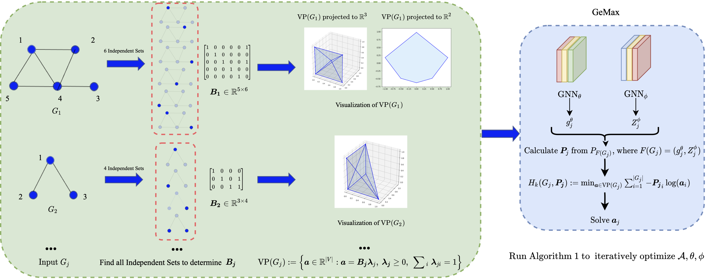

# Learning Graph Representation via Graph Entropy Maximization (GeMax)

[](LICENSE)
[](https://pytorch.org/)
[](https://www.dgl.ai/)

 This is the code repository for [[Paper](https://icml.cc/virtual/2024/poster/32687)]: "Learning Graph Representation via Graph Entropy Maximization (ICML 2024)". GeMax is an approximation method leveraging orthonormal representation for graph representation learning by maximizing graph entropy.



## Installation

1. Clone the repository:
```bash
git clone https://github.com/MathAdventurer/GeMax.git
cd GeMax
```

2. Create a new conda environment using the provided `environment.yaml` file:
```bash
conda env create -f environment.yaml
conda activate gemax
```

**Note:** GeMax requires [NVIDIA CUDA (version >= 11.3)](https://developer.nvidia.com/cuda-toolkit) and NVIDIA GPUs. The project depends on [PyTorch](https://pytorch.org/), [Deep Graph Library (DGL)](https://www.dgl.ai/), [NetworkX](https://networkx.org), and [scikit-learn](https://scikit-learn.org/) libraries, etc. For more information, see the `environment.yaml` file.

## Usage

To train and evaluate a model using GeMax, run the following command:

```bash
python main.py --config configs/gemax_infograph_mutag-example.yaml
```

The `config.yaml` configuration file contains the following settings:


- `dataset`: The name of the dataset to use for training (e.g., MUTAG).
- `mode`: The mode of the script, either "train" or "evaluate".
- `model`: The type of graph neural network to use (e.g., infograph, gin).
- `batch_size`: The batch size for training.
- `hidden_dim`: The dimension of the hidden layers in the model.
- `out_dim`: The dimension of the output embeddings.
- `lr` and `lr_A`: The learning rate for the optimizer.
- `num_epochs`: The number of training epochs.
- `eval_every`: The frequency of evaluation during training (in epochs).
- `mu`: The regularization coefficient for the orthogonal loss.
- `gamma`: The regularization coefficient for the sub-vertex packing loss.
- `seed`: The random seed for reproducibility.

To evaluate a trained model, run:

```bash
python main.py --config configs/gemax_infograph_mutag-example.yaml --mode evaluate --model_path path/to/trained/model.pth
```

## Project Structure

```
GeMax/
    ├── data/
    │   ├── MUTAG/
    │   ├── PROTEINS/
    │   ├── DD/
    │   ├── NCI1/
    │   ├── COLLAB/
    │   ├── IMDB-B/
    │   ├── REDDIT-B/
    │   └── ...
    ├── configs/
    │   └── ...
    ├── models/
    │   ├── __init__.py
    │   ├── gemax.py
    │   ├── gin.py
    │   ├── infograph.py
    │   └── ...
    ├── utils/
    │   ├── __init__.py
    │   ├── data_processing.py
    │   ├── evaluation.py
    │   └── utils.py
    ├── figures/
    │   └── ...
    ├── main.py
    ├── experiment.py
    ├── evaluate.py
    ├── environment.yaml
    ├── README.md
    └── LICENSE
```

## Citation

If you find this work useful, please cite our paper:

```bibtex
@InProceedings{pmlr-v235-sun24i,
  title = 	 {Learning Graph Representation via Graph Entropy Maximization},
  author =       {Sun, Ziheng and Wang, Xudong and Ding, Chris and Fan, Jicong},
  booktitle = 	 {Proceedings of the 41st International Conference on Machine Learning},
  pages = 	 {47133--47158},
  year = 	 {2024},
  editor = 	 {Salakhutdinov, Ruslan and Kolter, Zico and Heller, Katherine and Weller, Adrian and Oliver, Nuria and Scarlett, Jonathan and Berkenkamp, Felix},
  volume = 	 {235},
  series = 	 {Proceedings of Machine Learning Research},
  month = 	 {21--27 Jul},
  publisher =    {PMLR},
  pdf = 	 {https://raw.githubusercontent.com/mlresearch/v235/main/assets/sun24i/sun24i.pdf},
  url = 	 {https://proceedings.mlr.press/v235/sun24i.html}
}
```

## License

This project is licensed under the MIT License. See the [LICENSE](LICENSE) file for more information.
